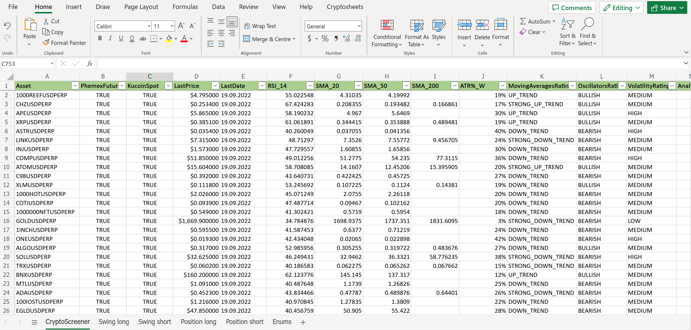

# Crypto screener
Application for calculating the ratings based on the indicators (SMA 20, SMA 50, SMA 200), oscillators (RSI) and volatility (ATRW%) for Phemex futures and Kucoin spot cryptocurrencies.



## How to build
```bash
./build.sh
```

## How to deploy
```
./deploy.sh
```

## How to prepare
```bash
./prepare.sh
```

## How to run
```bash
./run.sh
```

## Technologies
* Python 3
* Pandas
* Pandas-ta
* CCXT
